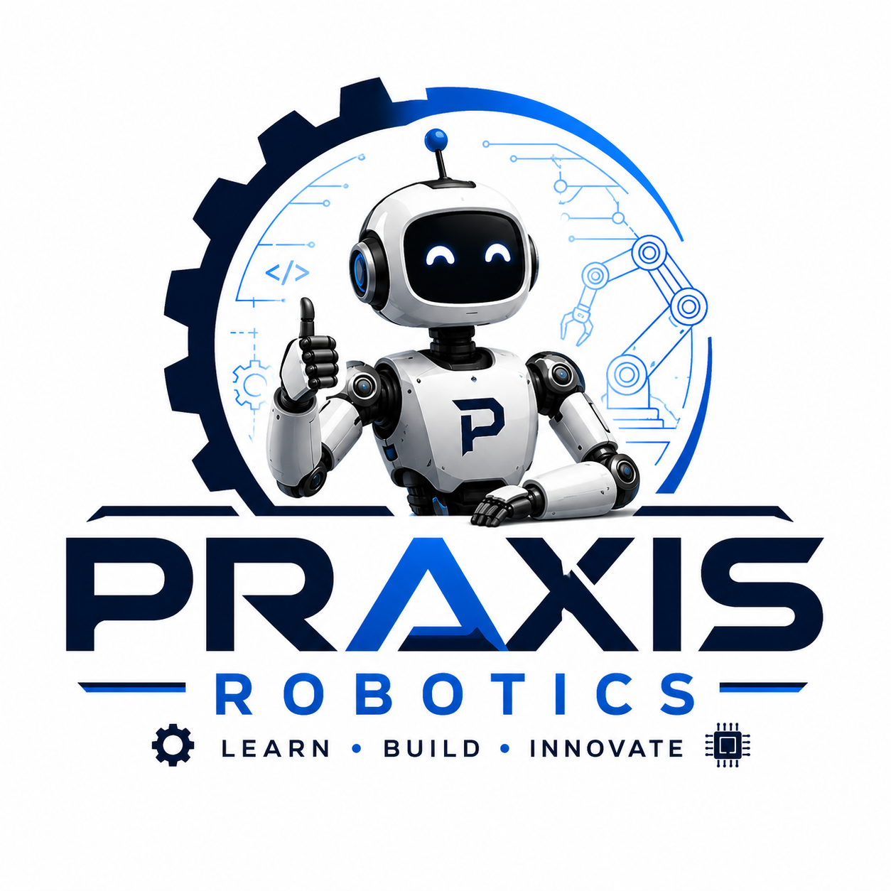

  

# Robotics Tutorials for Beginners

Building an LLM-enabled robot car — 
step by step, beginner friendly, full code.

## Hardware Stack

| Component | Purpose |
|-----------|---------|
| Jetson Orin Nano 8GB | AI brain — runs local LLM |
| LeRobot arm | Manipulation |
| RPLidar C1 | 360° SLAM mapping |
| 160° FV camera | Wide angle vision |
| 77° FV camera | Depth and detail |
| IMU | Orientation and motion |
| Yahboom Motor encoders | Odometry |

## Tutorial Plan

- [x] Hardware assembly and wiring
- [x] ROS2 setup on Jetson Orin Nano
- [x] Local LLM integration (llama.cpp)
- [ ] IMU integration
- [ ] LIDAR integration
- [ ] Camera integration 
- [ ] Full SLAM navigation
- [ ] LeRobot arm control
- [ ] LLM-guided task execution

## Status

🟡 Hardware arriving — tutorials starting soon

## Follow Along

- 🌐 [plasso.ai](https://plasso.ai)
- 🐦 [@plassoai](https://x.com/plassoai)
- 📧 hello@plasso.ai
